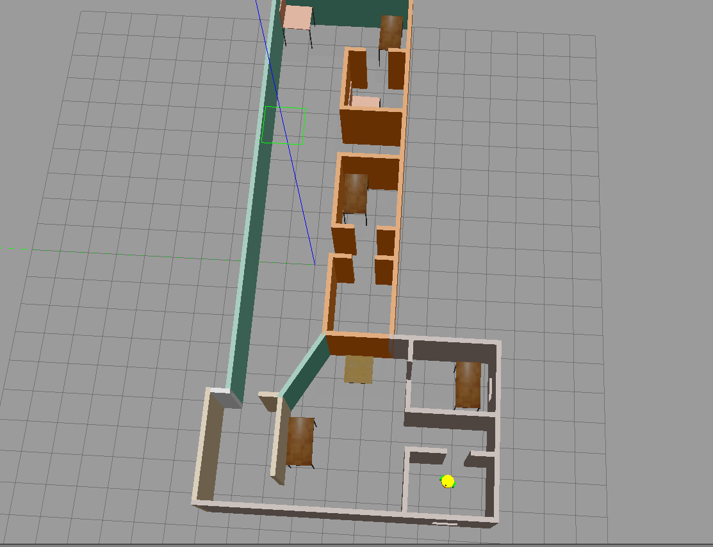
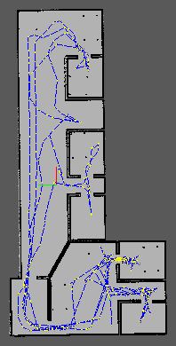
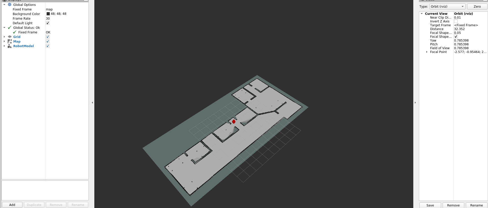
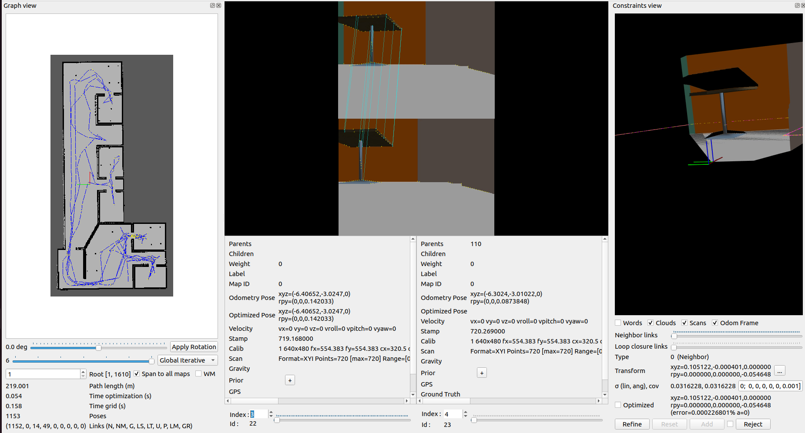

# Project 4: Map My World

An application of [rtabmap-ros](http://wiki.ros.org/rtabmap_ros) package for 
simultaneous localization and mapping (SLAM) of a mobile robot. 
This project is part of Udacity Robotics Software Engineer Nanodegree.

<table style="width:100%">
  <tr>
    <th><p>
           </a>
           <br>Original Gazbebo  Environment
        </p>
    </th>
    <th><p>
           </a>
           <br>3D Map
      </p>
    </th>
  </tr>
  <tr>
    <th><p>
           </a>
           <br>2D graph
      </p>
    </th>
    <th><p>
           </a>
           <br>Occupancy Grid Map in Rviz
      </p>
    </th>
  </tr>
</table>

## Description
The project consists of the following parts:
1.  A Gazebo world and a mobile robot.
2.  ROS package: [rtabmap-ros](http://wiki.ros.org/rtabmap_ros)

## Prerequisites
1. ROS (Noetic, Melodic or Kinetic), Gazebo on Linux
2. CMake & g++/gcc
3. Install `rtabmap-ros` package `$ sudo apt-get install ros-${ROS_DISTRO}-rtabmap-ros`

## Build and Launch

1. Clone project 
```
$ mkdir -p catkin_ws/src && cd catkin_ws/src/
$ git clone https://github.com/moavia90/Project4-Map_my_World.git
```
2. Move back to `catkin_ws\` and build
```
$ cd ..
$ catkin_make
```

3. Launch the world and robot
```
$ source devel/setup.bash
$ roslaunch my_robot world.launch
```

4. Open another terminal (Ctrl+Shift+T), and launch the `mapping.launch` file. 
Here, the rtabmap-ros package will be launched.
```
$ source devel/setup.bash
$ roslaunch Map_My_World mapping.launch
```

5. Open another terminal, and run the `teleop` node.
```
$ source devel/setup.bash
$ rosrun teleop_twist_keyboard teleop_twist_keyboard.py
```

7. Click on this terminal, type keyboard to navigate the robot around. Navigate 
the robot to scan its surrounding environment. The rtabmap-ros package will save
the resulted map with the localized trajectory of the robot in a database file 
`~/.ros/rtabmap.db`.

8. Open another terminal, and open up the database file using `rtabmap-databaseViewer`
```
$ rtabmap-databaseViewer ~/.ros/rtabmap.db
```

* Choose View -> Constraints View and Graph View
* To see 3D Map, Choose Edit -> View 3D Map 
    
You could also open the database I already generated in this project. The number
of loop closures can be found in bottom left of following picture.<br/><br/>
 
